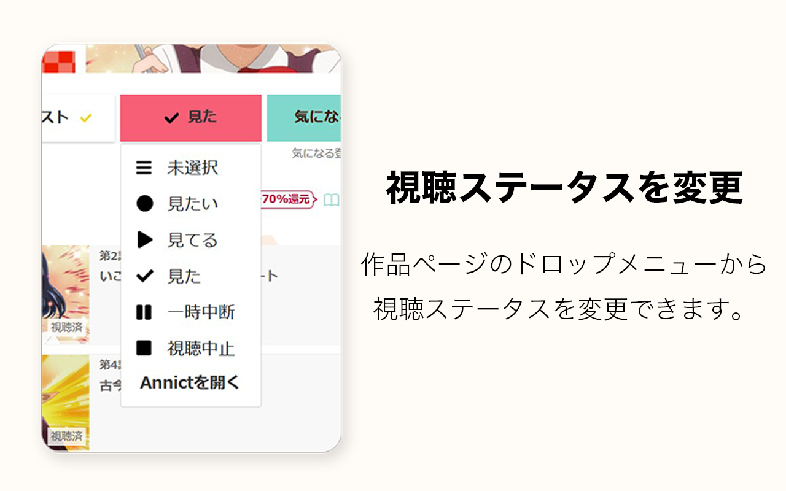
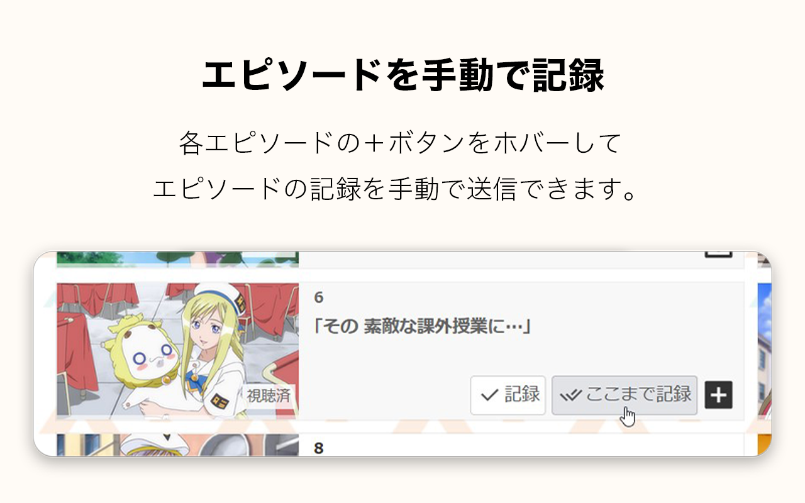
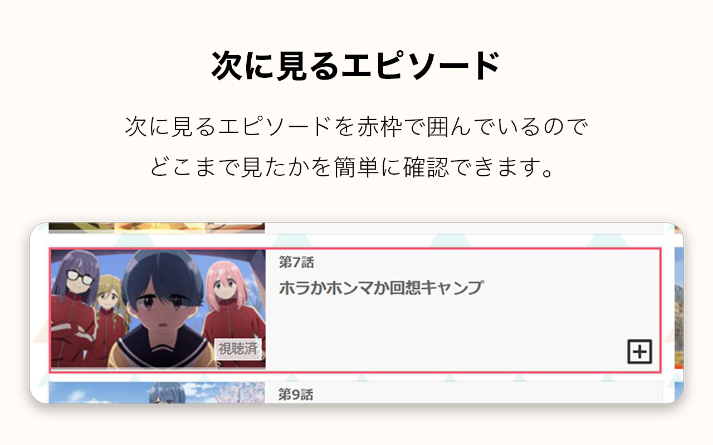
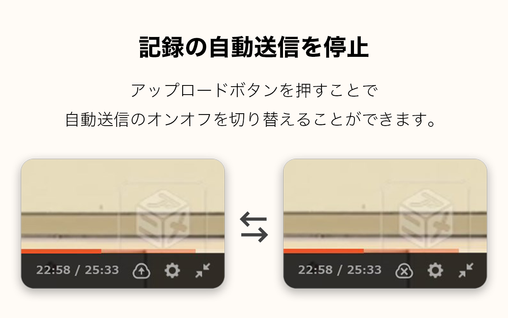
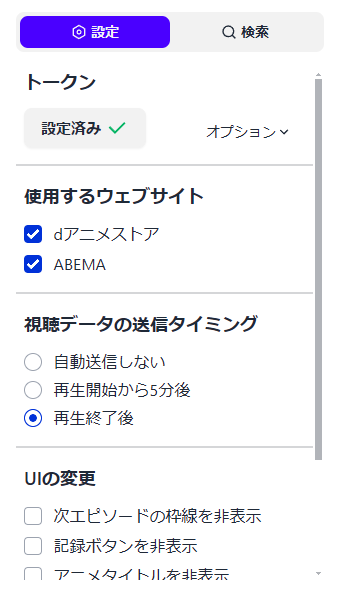
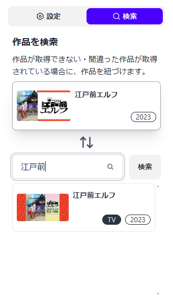

import { Aside } from "@astrojs/starlight/components";

## 視聴ステータスを変更

作品ページのドロップメニューから、視聴ステータスを変更できます。  
このボタンをホバーすると取得したアニメが表示されるので、正しいアニメが取得できているか確認することができます。

<Aside type="tip" title="ヒント">
    アニメを見る前に手動でステータスを変更する必要はありません。
    d-Recordは記録と同時に、自動でステータスを「見てる」に変更します。
</Aside>

## エピソードを手動で記録

各エピソードの＋ボタンをホバーして、エピソードの記録を手動で送信できます。  
設定から記録ボタンを非表示にできます。

## 次に見るエピソード

次に見るエピソードを赤枠で囲んでいるので、どこまで見たかを簡単に確認できます。  
設定から枠を非表示にできます。

## 再生終了後に自動で記録を送信

エピソードの再生が終了すると、自動で Annict に記録を送信します。  
設定から「自動送信しない」か「５分後に送信」に変更できます。

## 記録の自動送信を停止

再生画面のアップロードボタンをクリックすることで、自動送信のオンオフを切り替えることができます。

## 設定項目

    

拡張機能のポップアップから、自動送信の設定や UI の変更などを行うことができます。

## 作品を紐づける

    

作品が取得できない・間違った作品が取得されている場合に、作品を紐づけることができます。
