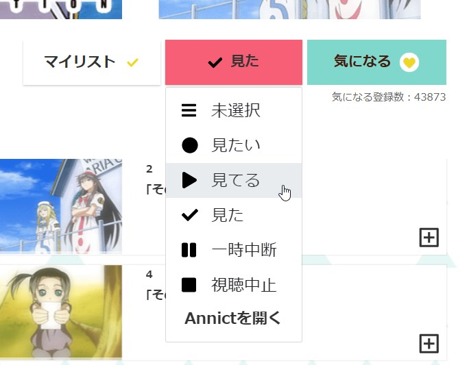
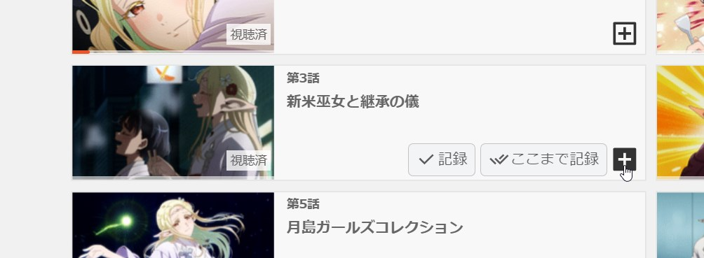
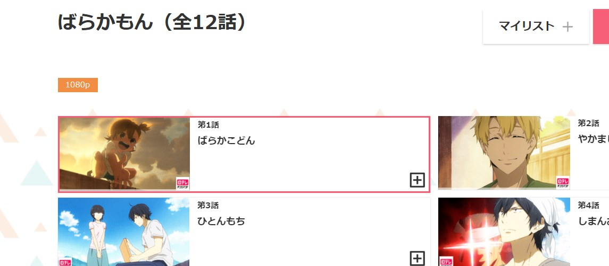
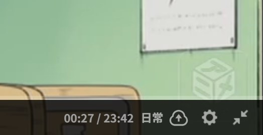

import { Aside } from "@astrojs/starlight/components";
import { Image } from "astro:assets";

import settingsLight from "../../../assets/settings.jpg";
import settingsDark from "../../../assets/settings-dark.jpg";

## 作品ページ

#### ステータスを変更

ドロップメニューから、ステータスを変更できます。

<Aside type="tip" title="ヒント">
    アニメを見る前に、手動でステータスを変更する必要はありません。
    d-Recordはステータスが「見てる」以外の場合、自動でステータスを変更します。
</Aside>

#### エピソードを手動で記録

各エピソードの＋ボタンをホバーすると、記録ボタンが表示されます。  
「記録」はそのエピソードのみ、「ここまで記録」はそのエピソードまですべてを送信します。

#### 次に見るエピソードを簡単に確認できる

次に見るエピソードは赤枠で囲まれているので、簡単に確認できます。

## 再生ページ

#### 再生終了後に自動で記録

そのエピソードの再生が終了すると、自動で Annict に記録を送信します。設定から「送信しない」か「５分後に送信」に変更することができます。

#### アップロードアイコンをオフにして、送信を停止

アップロードボタンをクリックすることで、そのアニメの送信を停止できます。  
また、再生開始直後には取得したアニメ名が表示されます。正しいアニメが取得できているか確認することができます。

## 設定項目

拡張機能のポップアップから、自動送信の設定や UI の変更などを行うことができます。

<Image class="dark:sl-hidden" src={settingsLight} alt="d-Record設定" />
<Image class="light:sl-hidden" src={settingsDark} alt="d-Record設定" />
