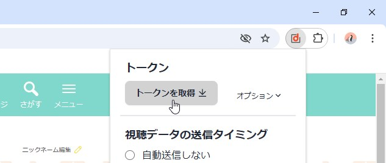
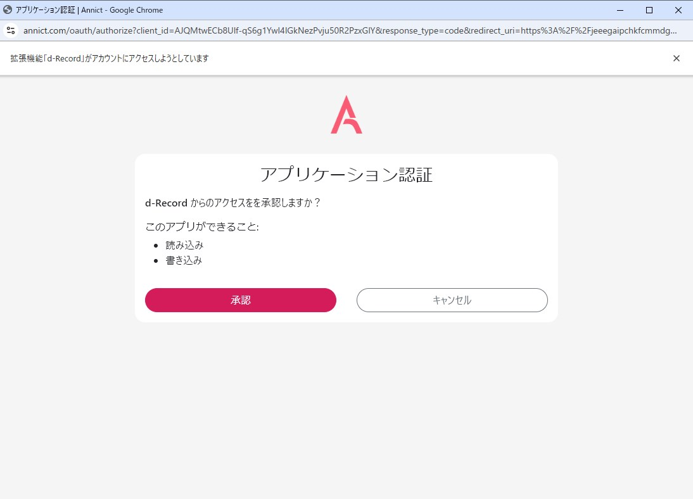

import { Steps } from "@astrojs/starlight/components";
import { Image } from "astro:assets";

import chromeWebstore from "../../assets/chrome-webstore.png";
import getTheAddon from "../../assets/get-the-addon.webp";

<Steps>

1. 拡張機能をダウンロード

    以下のボタンから、拡張機能をダウンロードします。

    

        <a
            href="https://chromewebstore.google.com/detail/d-record/blcncccafadeklhhhimddgbgojalmpgn"
            target="_blank"
            rel="noopener noreferrer"
        >
            <Image alt="Chrome WebStore" height="60" src={chromeWebstore} loading="eager" />
        </a>
        <a
            href="https://addons.mozilla.org/ja/firefox/addon/d-record/"
            target="_blank"
            rel="noopener noreferrer"
        >
            <Image alt="Firefox Browser ADD-ONS" src={getTheAddon} loading="eager" />
        </a>
    

2. Annict のアカウントを作成

    [Annict](https://annict.com/)のアカウントを作成します。

3. Annict のトークンを取得

    ブラウザ右上から d-Record アイコンをクリックします。  
    ポップアップが開くので、「**トークンを取得**」をクリックします。

    

    次にアプリケーション認証のウィンドウが開くので、「**承認**」をクリックします。

    

    ポップアップの表示が「**トークンを取得**」から「**設定済み**」になっていることを確認します。

</Steps>

これでインストール作業は完了です！
